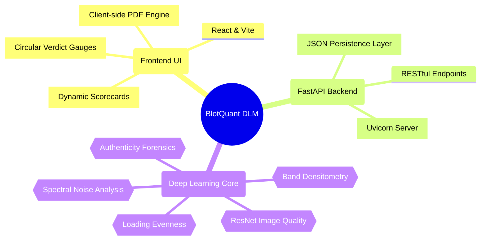

  <h1 align="center">🧬 BlotQuant DLM v3.0</h1>
  

    <strong>An end-to-end, hardware-agnostic deep learning pipeline for reproducible protein expression analysis.</strong>
  

  

    
    
    
    
  

---

## 🧠 System Architecture

## ✨ Key Features

- **Automated Forensics:** Validates image authenticity utilizing Patch Forensics, ELA (Error Level Analysis), and Spectral Noise detection to catch copy-move or editing artifacts.
- **Deep Learning Densitometry:** Analyzes band sharpness, signal-to-noise ratio, and loading evenness for reproducible results.
- **Composite Verdict Engine:** Translates complex raw data into a layman-friendly "Satisfactory / Unsatisfactory" grading score (0-100%).
- **Interactive PDF Reports:** One-click automated PDF generation for laboratory documentation and faculty presentations.
- **Standalone Portability:** No external databases required! Uses a lightweight local JSON store and comes with a `START.bat` automated runner.

## 🚀 Quick Start Guide

You don't need complex terminal commands to start BlotQuant. We provide an automated boot script for Windows.

### Prerequisites
- **Python 3.10+** (Added to PATH)
- **Node.js 18+** (Added to PATH)

### Running the Platform
Simply double-click the `START.bat` file in the root directory. 
This script will:
1. Auto-install all Python backend requirements.
2. Auto-install all React frontend dependencies.
3. Start the FastAPI backend on `http://localhost:8001`.
4. Start the Vite React frontend and open your browser automatically.

> **Note**: To stop the servers, just close the terminal window that `START.bat` opened!

## 🧪 The Deep Learning Pipeline (10 Modules)

| Analysis Module | Underlying Technology | Purpose |
|-----------------|-----------------------|---------|
| **Band Detection** | OpenCV adaptive thresholding | Locates protein bands and lanes |
| **Densitometry** | Integrated pixel density | Measures exact protein expression |
| **Authenticity** | Deep Learning ResNet | Forensic analysis for manipulation |
| **Patch Forensics** | Multi-region local variance | Catches copy-paste band cloning |
| **Spectral Noise** | Fast Fourier Transform (FFT) | Detects periodic editing artifacts |
| **SNR Engine** | Signal-to-noise calculation | Validates the background clarity |
| **Loading Evenness** | Horizontal distribution mapping | Ensures lanes are loaded equally |
| **Band Sharpness** | Edge gradient analysis | Evaluates focus and resolution |
| **Resolution Check** | Image processing | Detects heavily compressed images |
| **Verdict Engine** | Weighted Multi-layer Algorithm | Generates final 0-100% composite |

## 🎨 UI Aesthetics
BlotQuant DLM utilizes a **Premium 3D-Inspired Dark Theme** characterized by Cyan/Purple neon gradients, glassmorphism UI elements, and glowing interactive components for a cinematic user experience.

---
*Developed for robust, scientifically rigorous, and fully automated Western Blot analysis.*
